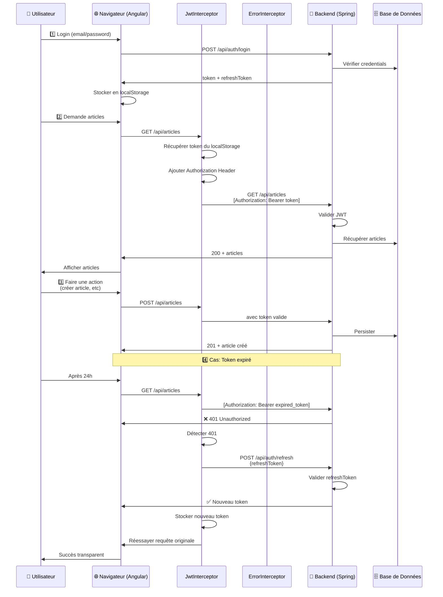
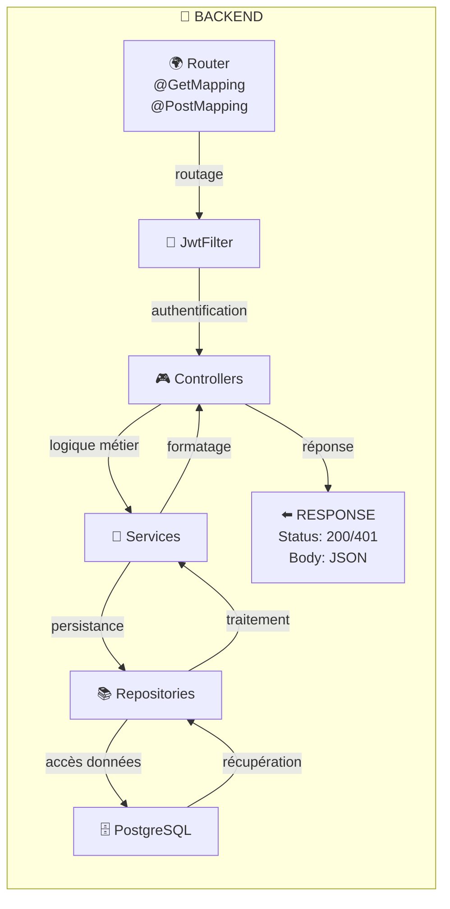
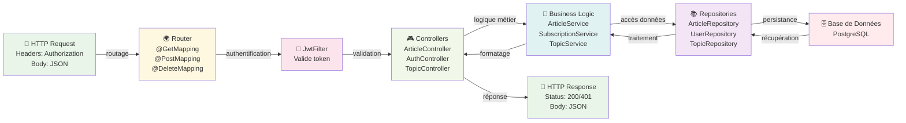

# 📊 Architecture du Projet

## Communication Client-Serveur

### Flux de Communication (Séquence d'appels)

### Architecture Requête-Réponse (Backend)

### Architecture Requête-Réponse (Version Diapo - Horizontal - Backend uniquement)

---

## 📡 Points clés de votre architecture

| Élément | Rôle |
|---------|------|
| **JwtInterceptor** | Ajoute le Bearer token à chaque requête |
| **ErrorInterceptor** | Gère les 401, déclenche refresh automatique |
| **AuthGuard** | Protège routes privées (**/articles**, **/profile**) |
| **UnauthGuard** | Protège routes publiques (**/login**, **/register**) |
| **JwtFilter (Spring)** | Valide token avant de router vers les contrôleurs |
